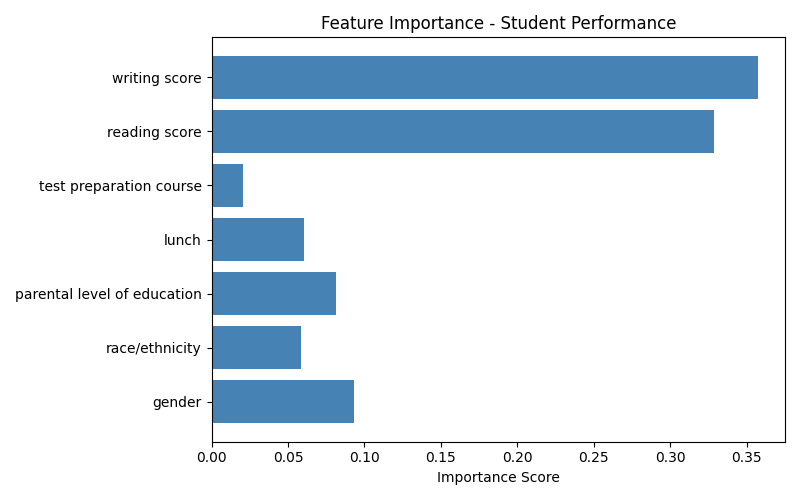

# Student Performance Predictor

A machine learning web app that predicts whether a student will pass or fail math based on demographic and academic factors.

## Live Demo
[Live Demo](https://at-student-predictor.streamlit.app)

## What It Does
- Takes student inputs: gender, race, parental education, lunch type, test prep, reading & writing scores
- Predicts: Pass or Fail in math with confidence percentage

## Models Trained
| Model | Accuracy |
|---|---|
| Logistic Regression | 89.00% |
| Random Forest | 87.00% |
| KNN | 84.50% |

## Key Insight
Writing score and reading score are the strongest predictors of math performance — outweighing demographic factors significantly.

## Tech Stack
- Python, Scikit-learn, Pandas, NumPy
- Streamlit (UI + deployment)
- Matplotlib, Seaborn (visualization)

## Screenshots

## How to Run
pip install -r requirements.txt
streamlit run app.py